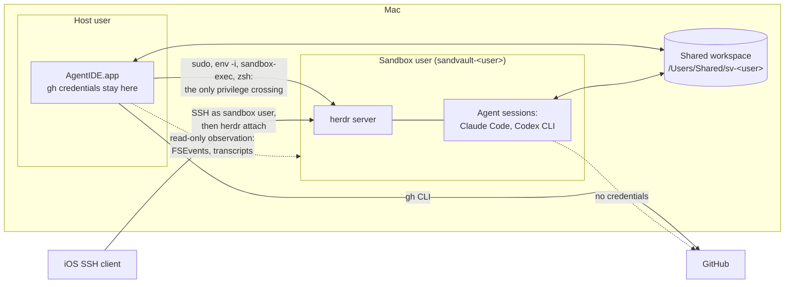
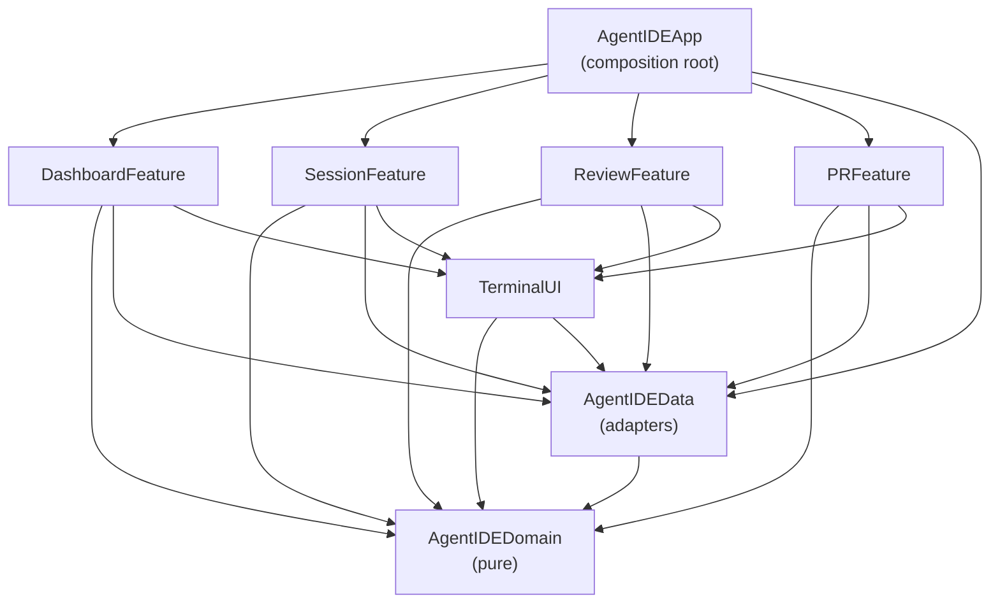

# AgentIDE Architecture

How AgentIDE works under the hood. [README.md](README.md) owns what it
does and why; this document owns the design: what exists, the rules that
keep it working and what is planned. It is written for whoever changes
the code next, human or agent, so each rule says what breaks without it.
Platform quirks (macOS beta, SwiftUI, SwiftFormat, the sandbox toolchain)
live in [AGENTS.md](AGENTS.md); this document does not repeat them.

## Overview

AgentIDE is a native SwiftUI macOS app (macOS 27 or later, Swift 6.4,
AGPL-3.0) that runs, steers and reviews sandboxed AI coding agents in
parallel git worktrees. Its user supervises rather than types, so the
window is arranged around the agent loop, not around an editor.

The architectural thesis, referenced throughout: **AgentIDE holds no
session-critical state**. Agents run as the sandvault sandbox user inside
a [herdr](https://herdr.dev) server that AgentIDE introduces. The app
derives its entire view of the world from herdr, git, agent transcripts
and GitHub, and persists only its own metadata. Killing, crashing or
updating the app loses nothing.

## System context



Boundary facts the design relies on:

- The sandbox may write only to the shared workspace, its own home,
  `/tmp`, `/var/folders` and `/dev`. The host user's home is unreadable
  from inside and keychains are denied.
- The shared workspace is writable by both users through inheriting
  ACLs; it is the data plane for code, prompts and events.
- The sandbox has no GitHub credentials: `gh` is unauthenticated there
  and agent settings deny `git push`. Pushing and everything
  credentialled happens host-side.
- Credentials never cross the boundary in either direction.

## Guiding principles

1. **P1: Derive, don't own.** herdr, git, transcripts and GitHub are the
   sources of truth. The app reconciles from them on every launch.
2. **P2: Unprivileged glue.** The only privilege crossing is the sudoers
   path sandvault already configured. AgentIDE never widens it.
3. **P3: Compiler-enforced boundaries.** Clean architecture mapped onto
   SPM targets; an illegal dependency is a build failure.
4. **P4: Approachable strict concurrency.** MainActor by default in UI
   targets, nonisolated core, `@concurrent` for heavy leaf work,
   structured tasks everywhere.
5. **P5: Agents are pluggable.** One `AgentRunner` seam; agent-specific
   logic lives only in adapters.
6. **P6: One client per external system.** git speaks through
   `GitClient`, GitHub through `gh` in `GitHubClient` and herdr through
   `HerdrClient`; nothing else shells out to them.
7. **P7: Agent output is hostile input.** Every host-side touch of
   guest-writable data is hardened accordingly.

## Process model

Two independent lifecycles: the app process is ephemeral and holds
nothing it cannot rebuild (P1); sessions are herdr workspaces owned by
the sandbox user's herdr server, surviving app restarts, updates and
host logout but not reboot. Reboot recovery is worktree plus transcript
plus resume.

### Launching into the sandbox

sandvault's sudoers rules let the host user run exactly `/bin/zsh`,
`/usr/bin/env` and `/usr/bin/true` as the sandbox user without a
password, so every sandbox interaction uses one launch shape, assembled
in exactly one place (`SandvaultLauncher`):

```bash
sudo --login --set-home --user="sandvault-${USER}" /usr/bin/env -i \
  HOME="/Users/sandvault-${USER}" USER="sandvault-${USER}" SHELL=/bin/zsh \
  TERM=xterm-256color COLORTERM=truecolor \
  INITIAL_DIR="${WORKTREE}" SHARED_WORKSPACE="/Users/Shared/sv-${USER}" \
  SV_SESSION_ID="$(uuidgen)" AGENTIDE_SESSION="${SESSION_NAME}" \
  LANG=en_US.UTF-8 \
  PATH=/opt/homebrew/bin:/usr/local/bin:/usr/bin:/bin:/usr/sbin:/sbin \
  GIT_CONFIG_COUNT=1 GIT_CONFIG_KEY_0=safe.directory \
  GIT_CONFIG_VALUE_0="/Users/Shared/sv-${USER}/*" \
  /usr/bin/sandbox-exec -f "/var/sandvault/sandbox-sandvault-${USER}.sb" \
  /bin/zsh -c "${PAYLOAD}"
```

This is byte-compatible with sandvault's own session launch; AgentIDE
only substitutes the payload. `env -i` gives a clean environment,
`GIT_CONFIG_*` injects `safe.directory` (shared repositories are owned by
the other user) and `sandbox-exec` confines everything downstream,
including the herdr server. Every launch passes through one function
that refuses a path outside the shared workspace: the sandbox user can
often read a host directory and must never be given a reason to write
to one.

### herdr

herdr is a client-server terminal workspace manager: a background server
owns real terminal panes grouped into workspaces, detects the coding
agent running in each pane and exposes everything over a schema'd,
newline-delimited JSON socket API (`herdr api schema`) the `herdr` CLI
wraps. It is pre-1.0 and admitted as an explicit exception to the
dependency rule below: a runtime tool behind one adapter, never linked,
whose agent-state model replaces machinery the app would otherwise
build.

- There is no daemon or launchd unit. The server starts lazily inside
  the sandbox on first use, through zsh's `&!` with output redirected
  to `~/.config/herdr/agentide-server.log`: this launch context has no
  controlling terminal, so `nohup` refuses to run ("can't detach from
  console"). A server that never answers has that log printed before
  the failure.
- `HERDR_SESSION` names the session, whose socket and state live under
  `~/.config/herdr/sessions/<name>/`, owner-only. The installed app
  uses `agentide`; development builds and tests use `agentide-dev`, and
  tests relocate herdr entirely with `XDG_CONFIG_HOME`, so no build or
  test can list or kill the installed app's sessions.
- Each conversation is one workspace whose single pane runs a login
  shell; the agent command is submitted to that shell (`pane run`)
  behind `export TMPDIR="$(mktemp -d)"`, because a server born through
  sudo resolves no usable temporary directory and Codex's execution host
  dies in its handshake without one. `AGENTIDE_SESSION` and
  `INITIAL_DIR` are workspace environment. A finished agent leaves the
  shell at its prompt with the scrollback inspectable; whether an agent
  runs comes from herdr's detection confirmed by the pane's foreground
  process, never from exit codes. The confirming matters most across a
  reboot, which herdr's own records outlive: a workspace it still says
  holds an agent comes back as a pane sat at its login shell, and
  believing it left the app attaching to that shell instead of
  resuming. A claim this run has not confirmed is checked once against
  the pane's foreground; a pane this run launched is confirmed as it
  starts, so steady state pays nothing and a new agent is never caught
  in the instant before its process registers.
- Workspace labels follow `agentide--<repo>--<branch-slug>--<agent>`
  (`SessionName`): slugs collapse `-` runs so `--` stays unambiguous,
  collisions append `-2`, `.` and `:` are replaced. Labels are a
  readable fallback for herdr's own UI over SSH; the metadata store is
  authoritative. Anything not matching the full shape is foreign and is
  shown only in the session manager, never in the sidebar: a row that
  cannot be entered and steered is noise.
- herdr's official agent integrations are not installed by the app: the
  Codex one flips Codex's hooks feature on, which broke command execution
  in fresh sessions. Hand-installed ones survive; the app neither adds
  nor removes them.
- The app keeps herdr's `[worktrees] directory` pointed at the layout
  below, written once per run only when the config has no such section,
  so `herdr worktree create` lands where the sidebar looks and a hand
  edit wins forever.
- herdr servers outlive the app, so a change to launch commands,
  workspace shapes or server behaviour needs the running session stopped
  (`herdr session stop <name>` as the sandbox user) to take effect.

- A pane listing that could not be read is not a listing of nothing
  (`LastPanes`). Taken as an empty one it emptied every session in the
  app at once: every row lost its agent, every pane read as exited and
  only relaunching brought them back, though herdr had lost nothing
  and the agents were still working. The last answer stands for two
  minutes of failures, after which an empty answer is believed, so a
  herdr that really has gone still shows as gone.

### Terminals

Agent panes attach to herdr as terminal controllers (`herdr terminal
session control <pane> --takeover`, newline-delimited JSON over pipes)
rather than drawing a remote screen over a PTY. herdr streams
`terminal.frame` records of base64 ANSI bytes, opening with a full
repaint, which the pane decodes (`HerdrTerminal` in Domain,
`HerdrTerminalChannel` in DataAccess) into a local SwiftTerm view;
keystrokes go back as `terminal.input`, resizes as `terminal.resize` and
the wheel as `terminal.scroll`. The channel reads its client through
the pipe's readability handler, never a blocking read: every mounted
pane keeps a client, most of them silent, and reads that wait on each
other left a fresh attach blank until some other pane's agent spoke.
Rules that follow from that shape:

- **Frames carry the screen, never the modes.** Cursor moves, colours
  and synchronised updates arrive; the private modes an agent set
  (bracketed paste, kitty keyboard) never do. So the local terminal
  never learns bracketed paste is on, and a paste sent as keystrokes
  submits at every newline. A herdr-backed pane wraps a paste in the
  bracketed-paste markers itself (`PaneTerminalView.bracketsPastes`)
  and sends it as one write; a local shell pane owns its PTY, sees the
  modes and needs nothing. A paste goes to herdr whole
  (`HerdrLargeInputIntegrationTests` pushes 180 KiB through one
  command); chunking it as separate commands only moved the loss. The
  remaining limit is herdr's: the PTY master accepts a write only while
  the slave's input queue is under `TTYHOG - 2` (1,022 bytes), and
  herdr 0.8.2 takes a short write as a whole one, so a reader that
  stalls while a large paste is in flight loses about a kibibyte from
  the middle (`HerdrSlowReaderIntegrationTests`, disabled until herdr
  waits or retries). Agents drain fast enough that this has not been
  seen in use; pacing the body inside one pair of markers would be the
  in-app mitigation if it is.
- **Scrollback lives in herdr.** The pane keeps none
  (`changeScrollback(nil)`), since a scroll answers with a repaint and a
  local history filled with replaced screens showed output three times
  over. The wheel pages herdr, the scroll indicator is hidden and Copy
  All Output reads `pane read --source recent-unwrapped`, because a
  selection can never reach what scrolled past. Known limitation: herdr
  does not rewrap scrollback on resize.
- **`--takeover`** replaces a controller leaked by an earlier app run,
  which would otherwise own the pane's input forever. Full herdr
  clients (SSH, Moshi) attach independently and are never dropped.
  Closing the view releases the controller and never kills the session.
- **Agent panes pin the palette recorded at launch**
  (`terminalSchemes` in the metadata). Agent TUIs read the colours
  once (OSC 10/11) and style their chrome for them forever; re-theming
  on an appearance switch left the composer white on white. Only shell
  panes re-theme live, and only shell panes answer Cmd-K.
- Copies from an agent pane reflow block by block for prose
  (`PasteableText`): paragraphs lose hard wraps, command-shaped runs
  keep every line. Option-drag copies a rectangle on the character
  grid; the held block also supplies Cmd-C and the Copy menu, without
  prose reflow. Starting a native selection clears both the held block
  and its marquee, so scrolling cannot restore an older copy.
  Processing a herdr frame preserves the selection, including cursor-only
  updates: mouse reporting is suspended for the synchronous feed and
  restored before handling input. SwiftTerm still moves or clears the
  selection when the selected text scrolls.

The **host terminal** is a plain login shell on the pane's own PTY as
the host user: no sudo, no sandbox, full `gh` credentials, editor
variables pointing at the app's shim, no server. Shells die with the
app, a deliberate trade after server-backed shells kept wedging their
control clients. Every running shell and browser page stays mounted
whichever tab or worktree shows, even while the selection is empty.
`RetainedPane` collapses the utility pane without removing its views or
changing their width. Inactive native views are hidden, so they draw
nothing and a page's animation frames stop. The session manager lists
them with a Close, each agent session beside the CLI version it started
with, which after an upgrade is not the installed one until it restarts.

Remote access is SSH to the Mac as the sandbox user, landing on the same
herdr server; `script/attach` covers the host user and the sandbox. No
picker of ours: one `herdr` attach presents every workspace with herdr's
navigation. The login needs only `HERDR_SESSION`, exported by the sandbox
user's shell configuration (synced from the workspace's `user/`
template), since a login from outside inherits none of the sandbox's
environment. Remote Login is enabled for the hidden sandbox user with
`dseditgroup` on `com.apple.access_ssh`.

### Reconciliation

On every launch the app rebuilds state from `herdr api snapshot`
(tolerating "no server running"), `git worktree list` across tracked
repositories, transcript directory scans and finally its own metadata.

Deriving is not trusting one reading: a listing can fail, and
`git worktree list` reports a worktree as detached for the whole of a
rebase. A row the newest reading dropped is kept while its directory
exists; only removal from disk removes the row. The provisional row a
new session draws (a `.pending` path, never a directory) is the one
exception: it is kept until its repository gains a listed row, since
the creation names the branch itself and the two never share a name,
and keeping it any longer sat it beside its own worktree for the whole
of the agent's launch. This is a display rule,
not a cache. It matters because a row holds its worktree's panes open,
and a pane holds a running shell. The same tolerance applies the other
way round: a mounted pane whose worktree vanished mid-read (a branch
renamed away, cleanup after a merge) reports nothing, since that is
the workspace changing rather than a failure, and the sidebar drops
the row on its own.

There is no windowless resident mode: the app quits with its last
window. Sessions keep running; the event spool is durable files, so a
quit app delays notifications rather than losing them. An `SMAppService`
login item is the documented later option.

## Package architecture

One root `Package.swift` defines every library target; the app shell in
`App/` is generated into an Xcode project by XcodeGen (`project.yml`
committed, `.xcodeproj` gitignored). `AgentIDEAppSources` in the package
carries the same sources so `swift build` type-checks them in the
sandbox, where `xcodebuild` cannot run.



- **AgentIDEDomain**: entities (`Repository`, `Worktree`,
  `RepositoryGroup`, `AgentSession`, `AgentKind`, `PullRequestSummary`,
  `ReviewThread`, `BranchStack`, `TranscriptSession`, `DiffFile`) and
  pure logic (`DiffParser`, `PatchBuilder`, `SessionName`,
  `HerdrTerminal` frame decoding, the keyword tokenizer, `FuzzyMatcher`,
  `Wrapping`). Foundation value types are allowed; process, file,
  network and database APIs are banned.
- **AgentIDEData**: the adapters, composed by `SessionService`:
  `GitClient`, `GitHubClient` (every question through the host's `gh`),
  `SandvaultLauncher`, `HerdrClient`, `HerdrTerminalChannel`,
  `TranscriptReader` and `CodexTranscriptIndex`, `EventSpool`,
  `MetadataStore` (one JSON file), `PullRequestStore`, `ProcessRunner`
  (Foundation `Process`), `WorkspaceWatcher` (FSEvents),
  `FoundationModelClient` (the on-device model behind one summarisation
  seam) and `AgentRunner` with `ClaudeCodeRunner` and `CodexRunner`.
- **Feature targets** (`DashboardFeature`, `SessionFeature`,
  `ReviewFeature`, `PRFeature`): SwiftUI views and `@Observable`
  MainActor models given the service by injection. `SessionFeature` owns
  the WKWebView browser, transcript log and session manager;
  `ReviewFeature` the diff and editor (SwiftUI text and an attributed
  `NSTextView`).
- **TerminalUI**: shared components, not a feature: the SwiftTerm
  wrapper, markdown rendering, tooltips, `LinkOpener`, `BusyButton`,
  `LaunchProgress`, `HighlightedResultsList` (the arrow-key result
  list every finder and searchable picker shows under its field),
  `SelectableTextView` (read-only document-style selection) and
  syntax highlighting (tree-sitter grammars, with
  the Domain's tokenizer as fallback for fragmentary text).
- **AgentIDEApp**: builds adapters, injects the service, owns navigation,
  Settings and the App Intents. No logic.

Third-party imports are confined (P3): SwiftTerm, swift-markdown,
SwiftTreeSitter and grammars in TerminalUI; WebKit in SessionFeature;
FoundationModels in AgentIDEData.

**One implementation per concern.** Terminals, editors, conversation
views, markdown rendering, git access, GitHub access and link opening
each have exactly one shared component or client. Every in-app link
takes `LinkOpener` (the window's `openURL`): web links to the Browser
tab, or the system browser with Cmd; anything without a web scheme and
host is refused with a message rather than handed to the system opener,
whose failure is an unhelpful "error -50". The terminal's link delegate
opens web links only and leaves a clicked file path selectable.

### The AgentRunner seam

`AgentRunner` (P5) covers exactly: the launch and resume commands for a
prompt file, model, effort and extra arguments; where the agent's
transcripts live (per working directory for Claude Code; one flat date
tree for Codex, which `CodexTranscriptIndex` attributes by the directory
each rollout records, keyed by file name stem because subagent rollouts
share their parent's embedded id); the models and efforts it offers; its
version and model listing command. Agent state (working, idle, done,
blocked) comes from herdr, the same for every agent, so no runner detects
anything. Foreign-session discovery is reconciliation in
`AgentIDEData`, outside the protocol.

Models are asked of every CLI once after first reading and kept in the
metadata under the CLI's version, so `claude models` (a twenty-second
sandbox launch) runs only when the CLI changed. Curated lists serve when
the command fails. The pickers re-validate the agent and model pair on
appearance as well as on change: a persisted Codex model once reached
Claude.

## Concurrency model

| Target | Default isolation | Notes |
|---|---|---|
| AgentIDEDomain | nonisolated | Sendable value types by construction |
| AgentIDEData | nonisolated | `@concurrent` on parsing and subprocess work |
| Features, TerminalUI | MainActor | `@Observable` MainActor view models |
| AgentIDEApp | MainActor | wiring only |

Under approachable concurrency `nonisolated async` runs on the caller's
actor, so quick awaited I/O stays plain; only CPU-bound or blocking leaf
work is `@concurrent`. Events flow as `AsyncStream`s consumed via
`.task`. Three actors are sanctioned, each guarding one resource:
`HerdrTerminalChannel`, `StackCache` and `RepositoryFacts`; another
needs a written justification here. `@unchecked Sendable` and
`nonisolated(unsafe)` are banned. Never loop awaiting a maybe-finished
task on an actor: keep one running and one queued follow-up. A reading
that asks for a reading (cleaning up after a merge does) gets the next
one rather than waiting: the one it is inside is waiting for it, and
each waited on the other until the app was restarted.

## Key data flows

### Start work

1. Input: a prompt, an issue or pull request number or a security
   advisory's GHSA id, plus repository, agent, model and effort. Every
   picker opens on something: the last
   pick where the chosen agent still offers it, and otherwise the first
   model that agent lists and the effort its own CLI would run at, so
   changing agent leaves a working choice rather than two empty pickers.
   The issue, pull request and advisory pickers open a search field over
   the repository's open ones (`ReferencedItemSearch` over any
   `ReferencedItem`): digits, with or without a `#`, match any part of
   a number, exact matches first; anything else matches a reference
   containing it (a GHSA id, case aside) and then ranks titles through
   `FuzzyMatcher`.
   Surrounding whitespace and line breaks are trimmed for pasted numbers.
   Advisories are the repository's own, read through REST
   (`repos/{owner}/{repo}/security-advisories`, one call per state,
   which is the only filter the endpoint takes) and only in the triage
   and draft states: a published one is public work an issue could
   carry and a closed one is over. They are listed only while the
   Advisory source is chosen and never cached in the metadata, since
   their titles describe unpublished vulnerabilities; issues and pull
   requests paint from their caches first.
   What was picked is remembered per agent in
   `agentide/session-defaults` in the shared workspace (`key=value`
   lines, since the sandbox has no JSON tool), merged by whichever
   surface starts a session. Submitting inserts a placeholder row
   instantly and narrates creation through `LaunchProgress` until herdr
   detects the agent's interface (`awaitReady`, bounded at a minute).
2. The branch name summarises the prompt through `FoundationModelClient`
   (underscore-separated, no prefix), or the prompt's first words when
   the model is unavailable. An advisory session is the exception: its
   branch is `improvements` (numbered on collision), never a summary,
   and its prompt tells the agent to write the commit message and any
   pull request title or body as an ordinary improvement, naming
   neither the advisory, its identifier, the vulnerability nor a fix.
   Branch, commits and pull request are all public before the advisory
   is, and a name summarising the prompt would have disclosed it.
3. The app fetches through `GitClient` unless the repository was fetched
   within the last hour, reusing the timestamp explicit fetches and
   rebases record. New branches start from origin's default branch,
   falling back to the local default or `HEAD` without one, and never
   track it as their upstream. `git worktree add` runs under
   `/Users/Shared/sv-<user>/worktrees/<repository>/<branch>`. Older
   `worktrees/<uuid>/<branch>` checkouts keep working because everything
   derives from `git worktree list`. Each poll also adopts checkouts the
   canonical listing does not know (an agent may clone a base of its own
   and cut worktrees from it), with the owning clone as their
   repository path. Sessions always launch from the real path because
   transcripts are keyed by cwd.
4. The prompt is written to `agentide/prompts/<session>.md` in the
   shared workspace and travels inside the launch command as
   `"$(cat …)"`, the path shell-quoted: pasting it after launch raced
   the agent's terminal setup, which flushed pending input. Trade-offs
   accepted: the prompt appears in the process's argv, and is bounded by
   the kernel's argument size.
5. No deploy keys; the agent works offline against the local clone.
6. The session is recorded in the metadata with its resume id once the
   transcript appears. Each start first clears `com.apple.quarantine`
   from the agent's Homebrew install (`Quarantine`) and records the
   CLI's version under the session name. The first start of a run also
   asks the sandbox, the way sandvault's `configure` does, whether the
   legacy login keychain still opens with the empty password sandvault
   gave it (`KeychainHealth`): since macOS 26.6 a reboot replaces that
   with the account's password (webcoyote/sandvault#206), after which
   `configure`'s credential lookup in it raises a keychain password
   dialog at every launch and Claude Code's credentials cannot move to
   sandvault's keychain. The probe only ever unlocks with a password
   given, which never prompts, and the manual steps (rebuild, remove
   that one file, sign in again) go once to the Messages pane; nothing
   deletes a keychain on anyone's behalf.

The same funnel serves three more entrances. `agentide new` (in
`bin/`, aliased from the bundle for SSH logins) asks its way to a
session in Homebrew's idiom, computes branch, label and paths by the
rules above rather than reading anything the app owns. It uses the
same default branch and hourly fetch limit, reading the modification
time of a non-empty Git `FETCH_HEAD` so fetches made by the app or a
terminal count too. A failed fetch stops creation. It runs itself as
the sandbox user when started as the host user, and focuses the new
workspace instead of attaching when already inside herdr
(`HERDR_PANE_ID`), which refuses a nested client. App Intents
(`App/AgentIDEShortcuts.swift`) resolve entities from the dashboard's
in-memory groups and reach the app through `AppDependencies.shared`,
since the system invokes them outside any view; they are tested from
the `AgentIDEIntentTests` UI bundle through `AppIntentsTesting`, with
Start Agent Session checked to exist rather than run. The repository
page resumes any past conversation into a fresh worktree.

### Watch and steer

- **Hooks.** `HookInstaller` manages the Claude Code settings template
  at `<workspace>/user/.claude/settings.json`, which sandvault rsyncs
  into the sandbox home each session start, adding its entries beside
  any existing notifier hooks for UserPromptSubmit, Stop, StopFailure,
  PostToolUse, PostToolUseFailure, PermissionRequest, SessionStart and
  SessionEnd in the defensive `[ -x … ] && … || true` shape. The hook
  appends a JSON line to `agentide/events/<session>.jsonl`, keyed by
  `AGENTIDE_SESSION` with `SV_SESSION_ID` as fallback.
- **An explicit fetch follows the default branch.** `origin/HEAD` is
  set at clone time and a fetch never moves it, so a repository whose
  default branch went from `trunk` to `main` kept reading as `trunk`.
  Fetch and Fetch and Reset on a row ask origin again (`git remote
  set-head origin --auto`), and a main checkout sitting on the old
  default is checked out on the new, made from origin's if there is
  no local one, before any reset; the note says so. The poll's own
  fetches never pay that round trip.
- **Unread.** A worktree is unread when its spool file or transcripts
  are newer than its per-worktree seen time; viewing records that time
  and a context menu marks it unread again. The selected worktree is
  seen as the reading reads it, and its time is written only when
  something has arrived since: stamping it on every reading rewrote
  the metadata file every few seconds to say nothing new. Raw terminal
  output counts for nothing: herdr keeps no output timestamp.
- **Agent state is an event, not a poll.** The dashboard keeps one
  `herdr agent wait --until <every state but the current>` per running
  agent, so a change refreshes at once; the poll stays for git and as
  the safety net. Whether the machine has a route out at all comes
  from the system's own path monitor (`NetworkMonitor.shared`,
  `NWPathMonitor`): without one every network call fails identically,
  so the app says so once, holds that work rather than spawning
  processes per branch per poll, and refreshes the moment the route is
  back. One reading serves them all: `gh` refuses at its own funnel,
  git refuses only the subcommands that reach a remote (`fetch`,
  `push`, `pull`, `clone`, `ls-remote`) so reading a worktree still
  works offline, and avatars keep what they have. Each refusal is one
  `OfflineError`, which `GitHubOutage` reads as an outage, so it is
  pooled rather than repeated. `ServiceStatus`
  keeps that apart from GitHub itself being down, and reports nothing
  at all while the machine is off the network. Any other read failure
  (a branch's pull requests, a conversation, the review pane's diff)
  is held until the same read fails again on its next poll or reload,
  then reported once naming both; a success in between makes the
  first not news, and one nobody reads again within a minute and a
  half is reported as it stands, saying so. Resuming a session is
  tried twice the same way (`ErrorLog.attemptingTwice`). A
  conversation that fell back to REST is a recovery that worked, and
  goes only to the messages log.
  Notifications fire for a finished turn and for input
  needed, each with its own toggle and chime: any audio file, played
  in the app's own process through `NSSound`, the way a Mac app plays
  a sound of its own. The system's alert path
  (`AudioServicesPlayAlertSound`) handed each chime to the audio
  daemon, which replayed one whose completion it lost, after a sleep
  and then for no reason it gave, in a loop until something displaced
  it; disposing on completion, on sleep and on wake each cured one
  case and not the next. Other apps either hand the sound to the
  notification itself, which macOS plays unreliably for custom files,
  or play it in-process as this now does; the cost is that the alert
  volume and the accessibility flash no longer apply. Nothing is
  played into a machine that has announced sleep, and what is
  mid-play stops then. An exit posts nothing. The Dock badge counts worktrees
  needing attention, each contribution behind a toggle.
- **Git reads are driven by the file system.** One FSEvents stream
  over the repository and worktree roots (`WorkspaceWatcher`) remembers
  what changed, and a reading asks git only about repositories
  something moved under, with safety re-reads at a minute for the
  selected repository and five for the rest. A repository's branches
  answer at once through `git for-each-ref` with `%(ahead-behind:)` and
  `%(upstream:track)`; the checked-out branch is read from the `HEAD`
  file; the full name comes from the remote URL, never `gh repo view`.
  Every read passes `--no-optional-locks` so nothing waits on an
  agent's index lock. Rows are kept between readings (`GitReadScope`).
- **A pane that is holding the machine down says so** (`PaneLoad`,
  `PaneLoads`). One `ps` every thirty seconds sums each pane's
  process tree and names its heaviest process; a tree over three
  cores for ten unbroken minutes puts a mark on that row, hovering
  it saying what is running and for how long. The thresholds are
  what keeps it honest: a repository's own test suite holds five
  cores for several minutes and must pass unremarked, while a linter
  that spun for half an hour starved every other worktree and left
  ten panes that all looked hung with nothing saying which one was
  the cause. The pane's shell is asked of herdr once and remembered,
  since it lives as long as the pane; the steady state is the one
  `ps`.
- **A model list is only as fresh as its key.** Each agent's models are
  discovered once per stamp rather than per launch, since asking costs a
  sandbox launch of about twenty seconds. The stamp is the CLI's version
  and, where the list lives in a cache the server rewrites
  (`modelCacheFile`, Codex's `~/.codex/models_cache.json`), that file's
  modification time: keyed on the version alone, a model added
  server-side stayed out of the picker until the CLI itself was
  upgraded. A cache written by a client older than the one installed
  is left unread and the last accepted list stands: the server gives
  each client the models it can use, and a session started before an
  upgrade kept rewriting the cache with its own list, so a model the
  new client knew vanished from the picker each time. The version the
  stamp was read from is kept for the launch and shown beside the
  agent's name in the pickers, never probed again for a render. Names
  shown are the ids read as words (`gpt-5.6-sol` is GPT
  5.6 Sol). Claude takes an alias saying nothing about its version and
  has no listing to ask, so the version is read from the identifiers
  Claude Code recorded using in its own state (`modelNamesFile`,
  `~/.claude.json`): `claude-fable-5-1` is what makes `fable` read as
  Fable 5.1, the newest of each family winning, and an alias no
  identifier names is shown as it is rather than guessed at. No model's
  version is written down in this app, and what is sent is always the
  name the agent takes.
- **Sidebar arrows show drift from upstream** (ahead or behind, none
  when level, the main checkout included) and a conflict icon where
  the pull request is unmergeable.
  Repository disclosure and new-session buttons use the surrounding
  padding as clickable space without enlarging rows. The plus sits
  beside the repository name and count, with a gap before it. Only
  rows with add buttons reserve extra scrollbar clearance; worktree
  text and selection backgrounds leave only two points at the edge
  and can extend beneath the scrollbar. Sidebar carets and plus icons
  gain a subtle rounded background on hover or
  keyboard focus, using the system label colour so it adapts to the
  appearance without changing their size. Repository headers keep the
  same spacing when expanded or collapsed, so rotating the caret never
  moves the label. Clicking the caret or repository header toggles
  expansion; hovering shows an Expand or Collapse tooltip naming the
  repository.
- Both pane dividers keep a one-point visible line and an eleven-point
  grab area over the adjacent panes. Hovering anywhere in that area
  shows the horizontal resize cursor before dragging begins. A
  double-click restores the controlled pane's default width, fitted to
  the current window, without changing the other pane's saved width.
  The right divider and Resize Panes allocate one-third of the width
  beside the sidebar to the utility pane, leaving two-thirds for the
  middle pane, within the pane width limits.
- **Fonts settings** groups code and terminal typography, repository
  names, worktree and branch names and utility tabs. Each has a font
  picker, a size stepper and a reset to the existing default. The first
  picker entry names the resolved default family; system choices still
  follow macOS's defaults. `CodeStyle`, `RepositoryStyle`, `NameStyle`
  and `TabStyle` observe their preferences through `AppStorage`, so
  changing a font or size redraws the affected views while Settings
  stays open.
  Mounted editors and terminals update their font in place, preserving
  documents and sessions; unchanged fonts do not trigger terminal
  layout or clear selections. Sidebar detail text follows the name
  size while keeping its original system font until a face is chosen.

### Review

1. `GitClient` produces diffs with rename detection; `DiffParser` turns
   them into files, hunks and lines. Scope is the last commit (or
   uncommitted changes when there are any), the unpushed commits, or
   the whole branch against its merge base, remembered per worktree
   (`ReviewModel+Scope`). Unpushed is what pushing would change on
   the remote with the base's movement factored out: the upstream
   replayed onto the base the branch now sits on (`git merge-tree`,
   a rebase as a merge with no worktree) and diffed against `HEAD`,
   so an amended commit shows the lines the amend changed, a rebase
   onto a moved base shows nothing, and the base's changes never
   show; the commits listed under it are those whose patch the
   upstream lacks (`git cherry`, bounded the same way). A replay that
   conflicts falls back to those commits' own patches. Only the tip
   can be amended; other commits review read-only.
2. Generated files (lockfiles and the like, by path fragment) hide by
   default.
3. Highlighting uses tree-sitter grammars (Swift, Ruby, Bash, Python,
   JSON, TypeScript and JavaScript, C, C++, Go, Rust, Java, PHP, HTML,
   CSS, regex, ERB), keyword lists for YAML, Markdown, Dockerfile, git's
   own editable files and keys-and-sections formats, and a generic pass
   for any other text. Tokens, markdown blocks and attributed strings
   are memoised by content.
4. Rejecting lines builds a reverse patch with `PatchBuilder`, validates
   with `git apply --check -R`, applies with `git apply -R --index` and
   amends. Uncommitted changes skip the amend. Every file's header
   opens it in the editor; an uncommitted tracked file can be put back
   to what HEAD has (`git checkout HEAD -- <path>`, staged changes
   included) and a never-committed one deleted, each after a prompt.
   Lines once turned into fields on a click, which could not be
   selected across and read as jank, so a diff is now only ever read.
   Each file appears once in the diff.
5. Every text surface has macOS text substitution off: curly quotes and
   em dashes are wrong in code and commit messages.
6. Cmd-F goes to whatever holds focus; `NSTextView` and terminals get
   the system find bar, and the diff opens its own bar through the
   storage bus. History's hunks each draw as one selectable text
   (`DiffHunkTextView`): a drag crosses lines, a copy strips the
   embedded gutter so it pastes as code, gutter clicks still toggle
   rejection, and the view declines the find action so Cmd-F falls
   through to the review bar, in every scope, uncommitted included.
   The messages pane is one selectable
   document the same way (`SelectableTextView` over the whole log),
   and every line in it reads the same: `repository: branch: what
   happened`, the repository bold and the branch monospaced, with
   any other identifier the line names in backticks drawn the same
   way (`MessageMarkup`). Both names come from the caller
   (`note(_:about:branch:)`), never from the message's own words, so
   no line has to name what the sidebar already names. Every surface
   draws such a name the same way (`NameStyle`, defaulting to the system
   monospaced design a size down from the prose beside it): the
   sidebar's rows, a pull request's header, the stack and branch popovers.
   That is chrome naming a thing; code's own typography is
   `CodeStyle`, whose face and size Settings owns.
7. Read-only text is never `.disabled`, which takes selection with
   editing: the binding drops writes and the view dims.

The **editor** is one `EditorPane` implementation filling two slots:
the utility pane's Editor tab and, when chosen, the centre pane. A
directory of your own is pinned to the centre slot; a worktree or
repository page opens it from an Editor button on its conversations
view, and the primary pane's branch order is what guarantees a live
session always outranks the centre editor, so one can never cover the
other. Every file remembers where it was scrolled to
(`EditorScrollPositions`, capped at two hundred files, written when
its editor goes away), so a worktree switch or a relaunch brings it
back in place unless a line was asked for by name. Each slot persists
its own finder and open file under
role-suffixed defaults keys; open-file and finder-focus requests
travel the shared keys and the window routes each to the preferred
slot: the side editor unless the centre editor is on screen, and
always the slot already holding the requested file, so one file never
opens in both. A move button on the open file sends it to the other
slot, and a session appearing in a worktree whose centre held the
editor (`agentide new`, a phone, a resume) moves the open file to the
side editor. Buffers survive every such displacement because an editor
saves on its way off screen; the Close button is the one deliberate
discard, and a file a command waits on is never written behind its
back. The two slots mounting together share one ripgrep file listing
per worktree (`FileListings`), joining a run in flight rather than
spawning a second. The editing shortcuts (Cmd-/ comment toggling per
language, Tab and Shift-Tab at the file's own indentation unit,
Option-arrow line moves, Cmd-D duplication, Cmd-Shift-K deletion and
Return carrying the line's indentation) are pure `LineEditing` rules
and whole-line range plumbing the text view maps selections onto,
each one undoable edit; saving strips trailing whitespace and
guarantees one final newline (`Whitespace`). The file's
`.editorconfig` chain overrides both: the Domain parses and merges it
(`EditorConfig`, nearest file and latest section winning, `root = true`
stopping the walk, `unset` clearing a property), the data layer reads
the files from the file's own directory up to the worktree root, and
the editor takes its indentation unit, its tab width and whether to
tidy on save from the answer. Silence keeps the app's own judgement,
so an unconfigured project behaves as it did. The glob subset (`*`,
`**`, `?`, classes and `{a,b}`) is the app's own: no Swift package for
the format meets the dependency rule below.

The **editor shim** (`bin/agentide`, on every shell pane's `PATH` as
`EDITOR`, `VISUAL` and `GIT_EDITOR` with `--wait`) spools one JSON
request per file into `AGENTIDE_EDITS` (or `~/.agentide/edits`),
written aside and renamed into place; the window watches the spool with
a dispatch source ringing a `DirectoryWake` that a loop waits on with a
backstop timeout, nothing cancelled on either side (the platform notes
say why), opens the file in the preferred editor slot and
writes `.open`, then `.done` with the exit status the shim takes (zero
saved, non-zero cancelled, which aborts a rebase). A symlinked file
resolves to its target before it is asked for: the editor saves
atomically, which would otherwise replace the link itself with a
plain file. On `.open` the shim
runs `open` on the bundle it shipped in, bringing the app forward: the
terminal's own child may ask that of the system where the app asking
for itself is refused by cooperative activation, and the copy outside
any bundle (the shared workspace's, for SSH) skips it. A request whose
process has gone is swept. Nothing inside the sandbox can reach the
spool. `AGENTIDE=1` lets shell configuration defer to the app;
`GIT_SEQUENCE_EDITOR` is left alone. The same command with a directory
selects the worktree holding it, and `agentide new` starts a session.

### Ship

- **Every GitHub question goes through `gh` and one gate,
  `PullRequestStore`**, which owns answers and the moments they arrived
  (in the metadata file, so relaunching does not restart the asking).
  Never repository-wide `gh pr list` on large repositories: query per
  branch, ten pull requests at most, never the default branch. A
  branch's listing is conditional REST (`If-None-Match`, a 304 costs no
  rate limit); a tag is dropped with the listing it stamped, since a
  304 answering for a listing no longer held reported no pull request
  at all. The head filter takes its owner from the branch's push
  remote, whether a URL or a named remote, while the request itself
  targets origin's repository. Fork comments and checks therefore
  belong to the upstream pull request. Merge queue membership is one
  aliased GraphQL query per repository (no pull request field reports
  it). A pull request merged or closed over thirty days ago is a name
  collision, not the branch's work. No cached answer is final, however
  green: skipping approved passing pull requests froze rows as open
  forever.
- **The tick is a safety net; events do the work.** A file changing
  under a worktree (FSEvents), an agent changing state (`herdr agent
  wait`) and every action of the app's own each wake a reading. The
  poll behind them re-reads on Settings' interval while the window
  shows, a minute while it is covered, and on battery a minute
  showing and five covered (`RefreshCadence`, `PowerSource`). A tick
  of its own asks herdr for the pane listing only once a minute
  (five on battery) and reuses the last listing between, since that
  listing changes only through the events above and asking is a
  `sudo` login shell; git is read only for repositories the watcher
  flagged or past their own safety interval. On battery every safety
  interval, the stack rota and every pull request tier (floors
  included) runs five times slower, one factor for the whole app.
- **Polling is tiered by attention** with a minute floor per pull
  request: selected worktree first, then its repository, then expanded
  repositories, collapsed ones rarely. A pull request with checks
  running or queued is asked every half minute, back to its tier after
  an hour (a stalled run or an outage must not be polled at that rate).
  A push paints its pull request's checks pending at once, in every
  cache a row or a pane reads (`markChecksPending`), since the last
  run's verdict is about commits that are gone; the mark outlives the
  paint, since GitHub takes a minute to see the commits and a listing
  fetched inside it still says what the old run did, so every fetched
  summary of that branch is painted pending until GitHub reports a
  head commit other than the one it last reported (`headCommit`), or
  a quarter of an hour passes. The push looks again a minute later,
  where the run it started shows.
  An agent's finished turn forgets its own branch's stamps, on the
  assumption the turn committed, so the same reading's pull request
  pass re-asks at once rather than waiting out the tier.
  Acting on a pull request clears its stamp; looking never does, and
  so does pressing Refresh: the tab drops the stamps of its listing,
  of the pull request in view and of that pull request's
  conversation, asks the sidebar for a git reading forced on this
  repository, and tells the conversation pane (which holds its
  threads in its own state, keyed by number) to read them again.
  Everything a refresh is pressed for -- checks finishing,
  mergeability, a review or comment arriving, unpushed counts --
  changes with nothing happening in the app, so the intervals that
  keep an idle tab quiet must not answer a click.
- **A draft's one action is to stop being one.** GitHub refuses to
  merge a draft and refuses automerge on one too, so the merge
  button reads "Mark ready" while a pull request is a draft and runs
  `gh pr ready`; the next click is the Merge, Queue or Automerge it
  would always have been. Nothing is cleaned up behind it, since
  nothing merged. Draft stays in its place afterwards, taking an
  open pull request back to a draft (`gh pr ready --undo`) for work
  that turned out to need more.
- **A pull request can open as a draft** through a button of its
  own: Open Draft beside Open PR, since the two make different pull
  requests and a toggle beside them said which without saying what a
  click would do. Both refuse for the same reasons, named once. The choice
  is kept with the rest of the form's draft, so leaving the tab and
  coming back finds the same intention, and the row the creation
  paints carries the draft glyph before any fetch has been near it.
  Both wait for the listed entry's own commits to be on the remote:
  a stack's entries each have their own count, and reading the
  worktree's (the checked-out branch's) offered to open a pull
  request for a branch nothing had pushed.
- **Nothing is stat'd that macOS would ask permission for.** A
  directory of your own can be anywhere: inside Documents, on a
  network volume, on a disk that is not mounted. macOS asks the user
  before a non-sandboxed app reads any of those and asks again the
  next time, so only the selected one is read from disk; every other
  row paints from what it last said (`HostFactsCache`). The
  home-directory sweep a repository deletion runs skips the guarded
  folders by name rather than reading and discarding them. There is
  no entitlement that declines these prompts in advance: the
  `NS*UsageDescription` strings in `project.yml` decide only what a
  prompt says, so the app's answer is to not look.
- **Amend adds to the commit before rather than making a new one.**
  On the uncommitted scope it folds the ticked files into the last
  commit and keeps its message, since the editor above the button is
  drafting the *next* commit's message, not rewriting this one's; on
  the scopes that show a commit it goes on doing what it always did
  and rewrites that message. The fold names its paths on the amend
  itself, so the last commit's tree plus those paths is what lands
  and anything else staged or uncommitted stays where it was. A
  commit already pushed needs pushing again, which the lease covers.
- **A commit can take some of the files, not all of them.** Every
  uncommitted file's row carries a tick, all ticked to begin with, and
  the button says what a click will carry ("Commit 3 of 7"). The model
  holds what is *unticked*, so a file the agent writes while the pane
  is open joins the commit rather than being silently dropped. A
  selective commit stages the named paths and names them again on the
  commit, so whatever else was staged stays staged; ticking everything
  goes back to `add -A`, since a commit of everything must sweep up
  what the diff never listed. The drafted message is used when there
  is one, and the menu command's own wording when there is not.
- **A hunk lays out in the engine that measured it.** The review's
  hunks are measured off screen (`HunkMeasurer`) because laying out
  a view's own container resizes it, and a measurement that resizes
  what it measures loops until AppKit kills the window. Both sides
  must therefore be TextKit 1: `NSTextView(frame:)` builds a
  TextKit 2 view that downgrades itself the first time anything asks
  for its `layoutManager`, and the two engines do not always break
  the same text into the same lines, so the height measured was not
  the height drawn and hunks painted over one another. Each hunk
  also clips to its own frame, so a wrong height can never take the
  file below it with it.
- **The editor reads like a code editor**: page guides at columns 80
  and 118 drawn under the text (`EditingTextView.drawBackground`),
  and a change bar down the gutter's inner edge for every line with
  uncommitted work (`LineNumberRuler`). The bar replaced a tinted
  line number, which said the same thing but could not be read down
  a scrolling file, which is the whole use of a change bar. Both
  measure the font's own advance and draw nothing for a face that is
  not fixed pitch.
- **One glyph per fact** (`ChecksStyle`). A row can carry failing checks,
  a reviewer asking for changes and a merge conflict at once, and all
  three used to be the same red crossed circle, which said "something is
  wrong" three times and which nothing was. Checks are a dot in both
  rows, red, green or orange, so a run finishing recolours a row rather
  than reshaping it; changes requested is GitHub's own diff glyph, since
  a person has written on the code; a conflict is a warning triangle,
  since it is nobody's verdict and the one state a pull request cannot
  leave on its own. Each badge's hover help names what it is, because colour cannot
  tell three red badges apart.
- **Row and pane never disagree**: both read the same two caches
  through `PullRequestStore`, the per-branch summary (which pull
  request a branch has) and the enriched summary (what state it is
  in), with the sidebar repainted through the storage bus whenever the
  pane writes either. So a pull request opened in the pane is on its
  row at once, without the poll having heard of it: the form records
  what it opened where the row already looks, GitHub's own listing
  where it has caught up and the bare facts the form knows otherwise,
  which the next fetch replaces.
- **A guarded default branch is not pushed from here.** Whether the
  default branch takes a push is GitHub's to say: the branch's own
  summary says whether classic protection is on it, and the rules
  endpoint lists every ruleset rule active on it, both readable with
  read access. Protection, or a rule wanting a pull request or
  passing checks, means a push would be refused, so Push dims there
  and says why and the menu bar's Push declines in the footer; a
  repository of your own with none of that takes the push and Push
  runs. Asked once per repository and kept until the tab's refresh
  button is pressed, since protection changes about as often as a
  repository's settings do; nothing known counts as guarded. The tab
  asks GitHub nothing else about the default branch.
- **Pushing** asks the branch first and GitHub second. A branch checked
  out from someone else's pull request carries that fork's URL in its
  config (all `gh pr checkout` leaves behind), so it is given a remote
  named after the fork's owner, with both its tracking and push remote
  set there; occupied names gain a numeric suffix so remote refs and
  leases still work. Every push and count follows that remote back to
  the fork. A fork's refusal reaches the pane without trying another
  destination. Otherwise `viewerPermission` decides: write access
  pushes to the repository, anything less to the viewer's fork
  (`gh repo fork` on first use).
  Either fork names the pull request's head `owner:branch`. Rewritten
  history pushes with `--force-with-lease --force-if-includes`. The bare
  lease protects nothing under constant background fetches;
  `--force-if-includes` is the real gate, refusing a remote tip never
  integrated locally (judged by the branch's reflog, which tells such a
  tip from an amend's stale twin). That refusal is resolved in-app,
  never with a terminal step: Rebase integrates the remote's commits,
  and when they conflict it sets the remote's version aside
  (`OverwriteTips`, rebasing onto origin/HEAD) so the next Push carries
  an explicit `--force-with-lease=<branch>:<tip>`. Never add `--force`.
- **Pushed is a tip, not a flag.** A push records the branch and the
  commit it sent, and Push stays dimmed with Open PR lit until that
  branch's tip moves, read with the other branch facts. The mark used
  to be a boolean any worktree refresh cleared, so counts gathered
  before the push arrived after it and swapped the two buttons back
  and forth until the next reading caught up.
- **A button says what it just did.** A finished rebase, sign or push
  turns its own dimmed button's label to the past tense (Rebased,
  Signed, Pushed) rather than narrating it in the middle of the bar,
  which is left for what went wrong and is cleared by the next
  success. Each label belongs to the entry it acted on, so reading up
  and down a stack never shows one branch's work on another's.
- **Signing.** Settings' Require signed commits (default on) makes Push
  wait for the tip to verify and rebases sign (`--force-rebase
  --gpg-sign` after a fetch); off, nothing signs or checks and nothing
  passes `--no-gpg-sign`. Verification is proof, never trust: Push
  dims until the current tip has been read as signed, fresh worktree
  counts re-read it (an agent's commits arrive between reloads), and
  the click reads it once more, declining in the footer with Rebase
  relit to sign; the service's own refusal stays as the backstop no
  user path reaches. The signed rebase picks the branch's own
  remote ref, including a contributor's fork, when it is still an
  ancestor and every commit unique to the branch verifies, else
  origin/HEAD. The ancestor test keeps an amended branch out of that
  path (its pushed commit is a stale twin, not a parent). A fetch
  inside the minute is reused (`gitFetchedAt`).
- **The same form edits an open pull request.** The pencil beside the
  browser button in the conversation's header (with Primer's Copilot
  Octicon between them, which asks Copilot for a review, or another
  after a push, through a review request naming
  `copilot-pull-request-reviewer[bot]` and dims from the ask until
  a Copilot review newer than it is seen: the ask's time is kept in
  the metadata's stamps, so a relaunch changes nothing, and GitHub's
  own pending request, which both readers carry, dims it too, since
  asking again then only queues the same review) puts the pull
  request's
  title and body into
  the creation form in the conversation's place, with the generate
  and reset buttons working as they do before opening and the labels
  and template sections left out, since those belong to the pull
  request itself; Save sends `gh pr edit --title --body` and repaints
  the row and the pane from the caches, Cancel is the one discard.
  The form's draft is keyed by the pull request while it is edited,
  so a half-done edit survives a tab switch and never touches the
  draft of a pull request yet to open. What it is for is bringing a
  description up to date with what was actually pushed before the
  pull request merges.
- **The creation form** shows when the branch has no open pull request:
  title, body and template as fields, drafts saved as typed and only
  ever filling an empty field, so reloads cannot take back typing.
  Labels come from `gh label list` once per form; an open conversation
  edits them with `gh pr edit --add-label`/`--remove-label`. The
  generate button drafts from the branch's commits through the
  on-device model and asks before replacing typed text. Fill template
  ticks every box and writes the AI disclosure from the session's model
  and effort, and only into a template. The template is read from the
  working copy or, for sparse checkouts, from git.
- **A stack moves as one.** Rebase on any layer, the bottom included
  and the menu bar's Rebase with it, restacks the whole stack and
  then pushes it, bottom first, since GitHub reads a pull request
  whose parent moved as no stack at all; the button reads Rebase and
  Push (or Sign and Push) with what comes down and what goes up, its
  help says why, the note names what was pushed, and Push then reads
  Pushed. While that button is live Push is not shown at all: two
  buttons for one job, and Push pressed first pushed branches about
  to be moved.
  Only one branch action runs at a time: while one does, Rebase and
  Push both dim, since a push pressed mid-rebase failed. Merge on any
  layer, the bottom included, is the stack's merge of that layer and
  everything below it: a stacked pull request merged as a lone one
  fails on a merge queue, which `gh pr merge` joins through
  auto-merge and GitHub refuses for stacked pull requests, where
  `gh stack merge` queues the layers in order. Rebasing one
  layer on its own rewrote what the layers above fork from, and the
  stack derived afterwards no longer reached them. Pushing any entry
  pushes every branch of the stack, bottom first, whether or not each
  has a pull request open yet, and Rebase and Push publishes such a
  branch the same way.
- **Forks cannot publish stacks across repositories.** Local ancestry
  stays inspectable, with counts and twin selection using each
  branch's own remote. A stack containing a fork disables creation,
  restacking, stack pushes and stack merges, and the service refuses
  them before changing any branch. A lone fork branch keeps its usual
  signing, rebase and push actions.
- **Stacks are derived, never recorded**: branches sharing a fork point
  beyond the default branch, ordered by where each forks; two branches
  at one commit are one entry and the name the remote knows wins.
  Reading one needs no checkout (`git diff parent...branch`). The
  derivation is cached against one `for-each-ref` line (`StackCache`),
  remotes included, since a fetch that moves the default branch changes
  what a stack is. The Stack popover drops branches by name (remembered
  per worktree) and cuts new ones. Restacking records every tip, then
  rebases bottom up with `--onto <parent> <recorded tip>`, signed,
  skipping a branch already in place and signed, from whichever entry
  asked. Each pull request opens against the branch below
  with both `--head` and `--base` named; `gh stack link` links what is
  open (idempotent, additive), and stack merge is
  `gh stack merge <number> --yes --merge-method <method>` after
  linking, offered only when every pull request below is mergeable,
  green and approved. Standing (`2/3`) comes from the pull request
  chain the store has cached, falling back to the worktree's derived
  stack. `gh stack view` knows only stacks it created; never read it.
- **One merge button, one readiness rule.** `isReadyToMerge` (open,
  not a draft, mergeable, checks green, review approved or none
  required) decides whether the button says Merge or Queue; anything
  short of it says Automerge and runs `gh pr merge --auto`, which is
  what GitHub's own refusal asks for. Judging from checks and
  mergeability alone offered Merge on a branch whose policy still
  wanted a review, and `gh` refused it. A repository with a merge
  queue has no automerge to ask for: `enablePullRequestAutoMerge`
  answers that the queue sets the strategy, and that automerge is
  unsupported for a stacked pull request. Its button says Queue
  throughout and dims until the pull request is ready.
- **Last mile buttons** say what they copy: Reviews and Checks,
  each carrying the app's copy symbol inline and its count in the run
  the sidebar's arrows use (`Reviews ⎘3` as `Push ↑9`, the symbol the
  same `doc.on.doc` every copy button uses), and nothing to copy is
  the word alone, greyed out. Reviews copies unresolved review threads grouped per
  file, dimmed until one is unresolved (the count comes from the
  threads the conversation pane has read, since no listing query
  carries it), with Cmd-click opening the pull request's files page,
  where a review comment is anchored and answered, and Shift-click
  opening it in the Browser tab; Checks is one button for the
  failing checks, dimmed
  until the rollup is red, that copies the head and tail of every
  failing run's `gh run view --log-failed` (forty lines of what was
  run and in what environment, a hundred and sixty of the failure,
  the progress between cut and counted, each end bounded in bytes
  too, 4 KiB and 16 KiB, since one dumped blob can outweigh the rest)
  condensed (job and step named
  once in a heading, timestamps and colour stripped), Cmd opening the check in the
  browser and Shift in the Browser tab. A run still in progress has
  no whole-run log, so its already-failed jobs answer with their own
  (`--json jobs`, then `--job <id> --log-failed` each) rather than
  failing while the rest of the run decides; gh gates even a
  finished job's view behind the run, so a refused job falls back to
  the plain REST job log, named once in front since that log carries
  no job column, and a job with no log to give yet is skipped rather
  than fatal. A job counts as failed on its own conclusion or on any
  failed step, since a check goes red the moment a step does while
  the job runs on. A run that hands over nothing is skipped too, so
  what the other runs have is still copied, and only every run
  coming back empty is reported — in the app's own words, never gh's
  "still in progress", and never a claim that GitHub has no logs: it
  has them and streams them live on the web, so the message says
  that the API gives a job's log up only once the job has finished
  and links each failed job's page (the run's own address and the
  job's id, from `--json url,jobs`).
- **Cleanup after merge** runs from the Merge button, the context menu
  and the poll (only on an observed open-to-merged transition, never a
  missing pull request) through one path: `git branch -d` refuses
  unmerged, a dirty worktree is refused, the main checkout is brought
  level with origin (reset when it carries nothing local, signed rebase
  when it does) and every merged branch deleted. Only Delete worktree
  forces, after a dialog naming what is lost. A repository is deleted
  only when `RepositoryGroup.deletionBlocker` names nothing.

### Sessions over time

- Closing a session closes the workspace (retrying when the polite
  close does not take) and records the deliberate close so automatic
  resumes leave the worktree alone. Reopening tries the recorded
  conversation, then the newest the worktree's transcripts name, then a
  fresh session, each attempt closing whatever holds the label first
  and never reusing a workspace: a resumed agent that exits at once
  looks like success, and a "fresh" start on an old workspace talks to
  a process whose files an upgrade deleted. herdr keeps sessions across
  app restarts, not across agent upgrades.
- While agents or shells run, `SleepInhibitor` defers idle sleep;
  sessions that died with sleep resume on wake.
- Every earlier conversation in a worktree is listed from its
  transcript directory and readable as a rendered log; resuming into a
  fresh worktree copies the transcript into the new cwd's directory
  first. Deleting a worktree keeps its conversations on the repository
  page: the recorded session names attribute orphaned transcript
  directories, and every directory under the repository's `worktrees`
  containers is scanned too.
- Transcripts live only in the disposable sandbox home, so each
  worktree's newest conversation is copied out (`ConversationBackup`)
  on close, on resume and hourly while running, to iCloud Drive or the
  app's directory, one file per worktree with an index beside it.
  Deleting the worktree deletes the copy. Only the conversation, never
  code.
- Host directories of your own list under a repository
  (`Worktree.isHostDirectory`), kept in the metadata as configuration,
  with the editor in the agent's pane and a menu of Copy path, Forget,
  Fetch and fast-forward-only checkout.

## State and persistence

| Fact | Source of truth | The app's role |
|---|---|---|
| Session liveness, scrollback, agent state | herdr | observe via the launch shape |
| Code, branches, diffs, worktrees | git in the shared workspace | operate host-side, hardened |
| Conversation history | agent transcripts | read-only |
| Pull request, CI and review state | GitHub via `gh` | poll, cache with timestamps |
| Unread markers, prompt history, per-repository settings, session names and resume ids, drafts, last sidebar snapshot | metadata store | sole owner |
| Window frame, display and fullscreen state | `UserDefaults` | sole owner |

The window's own shape is the exception to the metadata store.
`WindowConfigurator` keeps the frame, the display it was on and whether
it was fullscreen in `UserDefaults`. AppKit's frame autosave is not
used: SwiftUI names it when it makes the window and restores that entry
before the configurator runs, refuses the app a name of its own, and
since Monterey its restoration moves a window that was on a second
display to the main one, keeping where it sat within that screen, so the
window came back the right size in the wrong place however it was
stored. The configurator clears the name, so AppKit writes nothing more
under it, and sets the frame over whatever was restored: once as the
window is configured, so nothing shows at a default size, and again once
the window is really on a screen, since a frame set before then is
constrained to the main display. The window is invisible until that
second set, so it is never seen on the main display first, and a window
that never reports itself on a screen is shown where it is after a
couple of seconds rather than left invisible. Only then is the window
moved onto its display, brought onto a screen that exists if the one it
was left on has gone, and put into fullscreen, and only then are its
moves recorded, once each drag or resize pauses rather than per step.

The metadata store is `~/Library/Application Support/AgentIDE/state.json`,
outside the shared workspace so agents can neither read nor corrupt it.
Deleting it loses only unread state, settings and the attribution of
conversations to deleted worktrees. Rules:

- Every change goes through `MetadataStore.update`, which loads, changes
  and saves under one lock. Load-modify-save on a copy silently erased
  concurrent writes.
- One decoded copy stays in memory; loads after the first are
  dictionary reads. A save equal to memory writes nothing.
- Dated caches age out at a week beside their count caps.
- First paint reads only this file and the pull request store's caches:
  the sidebar, selection and every pane paint before anything is read,
  models paint from cache in their initialisers, and the review, editor
  and pull request surfaces stay mounted across tab switches. Only what
  herdr owns arrives late, and a row the cache says had an agent waits
  for herdr rather than claiming its session ended.

### Environment and the shared workspace

Two directories in the shared workspace are the app's own: `user/`, the
template sandvault syncs into the sandbox home, where the agent hooks
live and where your keys and shell configuration go, and `agentide/`,
holding prompts, hook events and `session-defaults`, which remembers
what the new session form and `agentide new` last chose. The app also
keeps `[worktrees] directory` in herdr's own configuration pointed at
its layout, so `herdr worktree create` lands where the sidebar looks.

The variables shell files and scripts can read or set:

| Variable | Set by | Meaning |
|---|---|---|
| `AGENTIDE` | the app, in shell panes | `1`, so shell files know they are inside the app |
| `SHARED_WORKSPACE` | you, for remote logins | the shared workspace `agentide` reads, when a login did not inherit it |
| `HERDR_SESSION` | your shell configuration | the herdr session name, `agentide` for the installed app |
| `AGENTIDE_SESSION` | the app, per pane | the session's label, which the agent hooks attribute events by |
| `AGENTIDE_EDITS` | the app, in shell panes | where `agentide --wait` spools the edit it is waiting on |
| `AGENTIDE_COLOR` | you | forces colour in `agentide`'s output where no terminal is detected |
| `AGENTIDE_PERFORMANCE_LOG` | you | turns the performance log on, as `script/performance-log on` does |
| `AGENTIDE_DEVELOPMENT_TEAM` | you, running `script/test` | the Apple team id signing the app and the App Intents runner alike, which the framework requires; unset, the bundle is skipped |
| `AGENTIDE_SKIP_INTENT_TESTS` | you, running `script/test` | leaves the App Intents bundle out even with a team set |
| `AGENTIDE_DRY_RUN` | you, running `agentide new` | prints what it would make instead of making it |

### From a phone

Sessions are reachable over SSH as the sandbox user;
[Moshi](https://getmoshi.app) speaks `mosh`, so a phone changing network
keeps its session. Two things are particular to sandvault and herdr, and
`sshd` is otherwise hardened however you would harden it:

1. The sandbox user's home is built from a template sandvault owns, so
   the client's key goes into that template and the home is rebuilt. A
   sandvault upgrade replaces the template, so keep this in your
   dotfiles if it must stay automatic:

   ```bash
   guest_keys="$(brew --prefix sandvault)/libexec/guest/home/.ssh/authorized_keys"
   cat "${HOME}/Downloads/moshi.pub" >>"${guest_keys}"
   sv --rebuild build
   ```

2. `agentide new` needs the shared workspace named, which a login from
   outside the sandbox does not inherit, in
   `/etc/ssh/sshd_config.d/000-agentide.conf` with your own user name
   and path, then Remote Login on for that account:

   ```text
   Match User sandvault-mike
       SetEnv SHARED_WORKSPACE=/Users/Shared/sv-mike
   ```

Aliasing the command in the sandbox user's shell configuration also
names the session:

```bash
alias an='/Applications/AgentIDE.app/Contents/Resources/bin/agentide new'
export HERDR_SESSION=agentide
```

Connecting as `sandvault-<you>` and running `herdr` presents every agent
workspace in one attach, so a session steered from the phone is the same
session.

Owner avatars cache per owner under `Application Support/AgentIDE/Avatars`;
a failed fetch is silent. The performance log
(`<workspace>/tmp/agentide/performance.log`, off by default, on with
`script/performance-log on`) records every process, `gh` call and cache
hit or miss; tests point it into the scratch directory. While it is on, every
message the Messages pane shows is also appended to `messages.log`
beside it: the pane does not survive a relaunch, and a fault worth
relaunching for is exactly what needs reading afterwards. One such
fault is a terminal pane that draws nothing: a control pane with no
frame, or only a blank screen, five seconds after attaching, its
client still running, is discarded and attached afresh once by
itself, silently, and reported only if that draws nothing either,
when the pane draws Reattach over itself (`StalledPaneOverlay`) so a
relaunch is never the only way back; a client that exits before drawing
(a stale pane target after a herdr restart, say) is held the same way
until the next attach draws or fails. Reattach in the pane's menu, or
the session strip's, does the same by hand. A size herdr was
already told is not sent again: the attach and the terminal's own size
callback both said the same size, and herdr 0.8.2 dropped the repaint
after that transient pair (0.9.0 says it repaints after transient
resizes).

## Security model

1. **Host to sandbox**: the sudoers surface is exactly `/bin/zsh`,
   `/usr/bin/env` and `/usr/bin/true` as the sandbox user (plus root
   teardown the app never uses).
2. **Sandbox to network**: no GitHub credentials, `git push` denied by
   agent settings.
3. **App to GitHub**: `gh`'s own credentials, read by `gh` alone, never
   in any launch environment.
4. **Host to guest-written data** (P7): every host git invocation goes
   through `GitClient`, which prepends `-c core.fsmonitor=
   -c core.sshCommand=/usr/bin/ssh -c core.hooksPath=/dev/null
   -c core.pager=cat -c protocol.ext.allow=never`. Raw `git` outside it
   is banned. `core.sshCommand` names ssh rather than being blanked:
   an empty value is the empty command, which git forks.
5. **Transcripts**: sandvault applies inheriting group-read ACLs; the
   app relies on read and never widens it.

The embedded browser uses the shared persistent data store so a GitHub
login survives restarts; it holds no app state and no token.

Never: modify sudoers or the profile; run credentialled commands inside
the sandbox; write secrets or app-critical state into the shared
workspace; execute agent-suggested commands as the host user without an
explicit action; bypass `GitClient`; widen transcript ACLs.

## Dependencies and toolchain

Admission rule: more than 1,000 GitHub stars and a stable release in
2026, or a recorded exception for an official language or project
organisation.

| Package | Role | Note |
|---|---|---|
| SwiftTerm | terminal emulator views | ships a build plugin; scripts pass `-skipPackagePluginValidation` |
| swift-markdown | markdown parsing | swiftlang exception |
| swift-tree-sitter | highlighting runtime | official-organisation exception |
| tree-sitter-* grammars | highlighting | pinned to ABI 14 releases the runtime accepts; Swift from alex-pinkus, the grammar the ecosystem standardises on, pinned to its generated-files tag's revision so Dependabot does not mistake it for older; Python stays on 0.23.6 and CSS on 0.23.2, whose manifests include their scanners without a root sentinel that breaks Go and embedded-template |

System frameworks (WebKit, UserNotifications, FSEvents, Network and
FoundationModels, weak-linked because CI's runner OS lacks it) and
runtime tools (herdr via Homebrew, never linked) sit outside the table.
No updater of its own: releases ship as the `agentide` Homebrew cask,
and `brew upgrade` is the updater.

Toolchain: Xcode 27, Swift 6.4, XcodeGen, SwiftLint and SwiftFormat with
every rule enabled (per-line disables with a reason). Scripts:
`bootstrap`, `build`, `install`, `zip`, `package`, `test`, `analyze`,
`style [--fix]`, `performance-log` and `attach [workspace]`; see
AGENTS.md. Sandboxed builds gate on `SV_SESSION_ID` and disable
SwiftPM's sandbox. Scripted SwiftPM builds also omit the
debugger-attach entitlement:
Swift 6.4 otherwise tries to sign SwiftTerm's resource-only bundle as
an executable and warns about a missing build-graph node. Interactive
Xcode builds retain their debugging entitlements.

Every first-party Swift target, including tests, treats warnings as
errors and enables strict memory safety alongside Swift 6's complete
concurrency checking. Unsafe interoperation is acknowledged at its
smallest boundary: AppKit's unowned references stay on the main actor,
C pointers stay within their owners' lifetimes and format arguments
match their fixed format strings. Xcode enables compiler, linker and
supported Clang analyser diagnostics, runs the analyser during builds
and fails on its findings. Dependencies keep their own compiler settings.
Style checks fail when any step fails, including a missing tool.

Tests are two tiers. Unit tests cover Domain's pure functions, Data
decoders over fixtures and the feature models, whose fetch and
file-system calls are stored closures tests replace with fakes (fakes
must reuse production path-encoding helpers, never hand-roll them).
Integration tests run the real adapters against real git repositories
and a real herdr server on a private config home, because the bugs that
reach manual testing live in the seams; test runners strip `HERDR_*`
from the environment so a teardown can never reach the production
server. CI (`.github/workflows/tests.yml`) runs style on
every push and pull request, and build-and-test and analyze in parallel
on the `xcode-27` image, each asserting Xcode 27 rather than skipping.
The test job also runs `script/test --sanitize address`, failing on
memory errors. `script/test --sanitize thread` checks for data races
locally. Both instrument package tests and, when signing is configured,
the App Intents tests. Thread Sanitizer currently catches SwiftTerm 1.19's
PTY reader racing process termination in `ShellLifetimeTests`. Its
[upstream lifecycle fix](https://github.com/migueldeicaza/SwiftTerm/commit/a7260892a5cfcd510f635e30ed0993d9397e3d16)
uses byte-loading APIs incompatible with the current Xcode 27 beta, so
the thread CI gate awaits a compatible dependency release. The race is
not suppressed or excluded from local runs.

### Releases

Three scripts turn a checkout into the artefact a release ships, split
so that only the last needs credentials:

- `script/version` decides the version and the build number, and is the
  only thing that does. It prints them for `script/build` and writes
  them as `.build/version.xcconfig`, which the generated project takes
  as its base configuration, so a build started in Xcode is versioned
  exactly as a scripted one; `script/bootstrap` writes it before
  generating the project, and the file is rewritten only when its
  contents change, so Xcode does not rebuild the world for it.
- `script/build` takes the most recent tag behind the current commit
  (`git describe --tags --abbrev=0`), validates it as three
  period-separated integers with no leading zeroes and passes it as
  `MARKETING_VERSION`. A release tags its commit before building, so
  it names itself; every build after that names the release it
  continues rather than claiming `0.0.0`, which is left for a
  repository with no tags at all. `CURRENT_PROJECT_VERSION` remains
  the build number and counts the default branch's commits, which is
  what tells two builds of one version apart. The release workflow selects the
  Release configuration; local builds stay Debug.
- `script/zip` verifies the built app's signature, then zips it with
  `ditto` as `.build/AgentIDE-<version>.zip`, the version read from the
  built `Info.plist`, with `AgentIDE.app` as the only top-level entry.
- `script/package` needs every credential in its environment and fails
  without them. `DEVELOPER_ID_APPLICATION_CERTIFICATE`, a base64
  encoded `.p12` export of the Developer ID Application certificate and
  its private key, with
  `DEVELOPER_ID_APPLICATION_CERTIFICATE_PASSWORD`, is imported into a
  temporary keychain. The script selects its one valid Developer ID
  Application identity, signs the app from
  `App/AgentIDE.entitlements` with a hardened runtime and secure
  timestamp, and restores the user's keychain list on exit.
  `NOTARIZATION_KEY`, the contents of an App Store Connect API key's
  `.p8` file, `NOTARIZATION_KEY_ID` and `NOTARIZATION_ISSUER_ID` send
  the zip to `notarytool`. The script waits for Apple's verdict, prints
  its log on failure, staples the accepted ticket, asks Gatekeeper to
  assess the app and remakes the zip around the stapled app.

The Release workflow (`.github/workflows/release.yml`) requires a bare
`MAJOR.MINOR.PATCH` version such as `0.1.0` on `workflow_dispatch` and
must be run on `main`. It rejects leading zeroes, `v`, prerelease
suffixes and build metadata, the development and dry-run versions, an
existing requested tag and a commit already carrying any tag. It
creates the local tag before building so `script/build` stamps it into
the app, then zips, signs and notarises. Nothing reaches GitHub until
packaging succeeds; only then does the workflow upload the zip as an
artefact, push the tag and create a release with generated notes and
the zip attached.

A push that touches the workflow, packaging scripts or metadata uses
`9999.0.0` as a reserved local-only version and repeats the build,
signing and notarisation as a dry run, but uploads no artefact and
pushes no tag or release. Dependabot cannot read Actions secrets, so
its dry runs skip signing and notarisation. Nothing here bumps the
cask: the `agentide` cask in Homebrew/homebrew-cask is open source and
Homebrew's own autobump reads each release through `brew livecheck`
and opens the pull request itself, so the release needs no GitHub
token of its own.

The release contract is also the cask contract: the tag is the bare
version, the zip is `AgentIDE-<version>.zip` and the app's
`CFBundleShortVersionString` is the same value, so the cask can use the
stable URL
`https://github.com/MikeMcQuaid/AgentIDE/releases/download/#{version}/AgentIDE-#{version}.zip`.
Every release is Developer ID signed with the hardened runtime,
notarised and stapled so Homebrew's signing audit and Gatekeeper accept
it. Releases are full releases, never drafts or prereleases, which lets
`brew livecheck` discover the next version without a custom strategy.

## Potential future plans

Not scheduled, recorded so the pieces already built line up with them:

- A CI fix loop: the poll already sees checks change, so a run turning
  red (a transition, never a repeat) can gather what the copy button
  gathers, write it into a prompt and hand it to the worktree's agent
  through `herdr agent prompt --wait`, or start a session; one attempt
  per run, never on the default branch, the push left to the human, with
  ask-first or automatic per repository.
- Reviewer comments addressed automatically: the unresolved threads the
  copy button gathers, sent the same way when a comment lands, each
  thread resolved when the agent's commit answers it.
- Scheduled jobs: per-repository cadence, agent and prompt template,
  each run in a worktree named by date so a failed run is inspectable
  and merge cleanup disposes of it.
- An Answer Agent intent, once herdr's key sending has a wrapper beside
  `typeText`, so a blocked question can be answered from a notification
  or a phone.
- A file-staging fallback for pastes beyond what a single write should
  carry, and a login-item helper if delayed notifications prove
  annoying.
- Seeding the local buffer from `pane read --format ansi` on attach so
  scrollback reflows on resize, keeping the wheel local off the
  alternate screen.

## Risks

| # | Risk | Mitigation |
|---|---|---|
| R1 | herdr is pre-1.0; releases may change behaviour | schema'd protocol; integration tests run against the real server so drift fails loudly; app-owned PTYs are not acceptable because they forfeit resilience |
| R2 | the `xcode-27` runner image may change or lag betas | jobs assert Xcode 27 and fail loudly; self-hosted is the fallback |
| R3 | agent transcript formats drift | tolerant decoders, per-release fixtures |
| R4 | sandvault updates could change paths, profile or sudoers | `SandvaultLauncher` is the single construction point |
| R5 | resume ids depend on transcript internals | record defensively; fall back to a fresh session in the same worktree |
